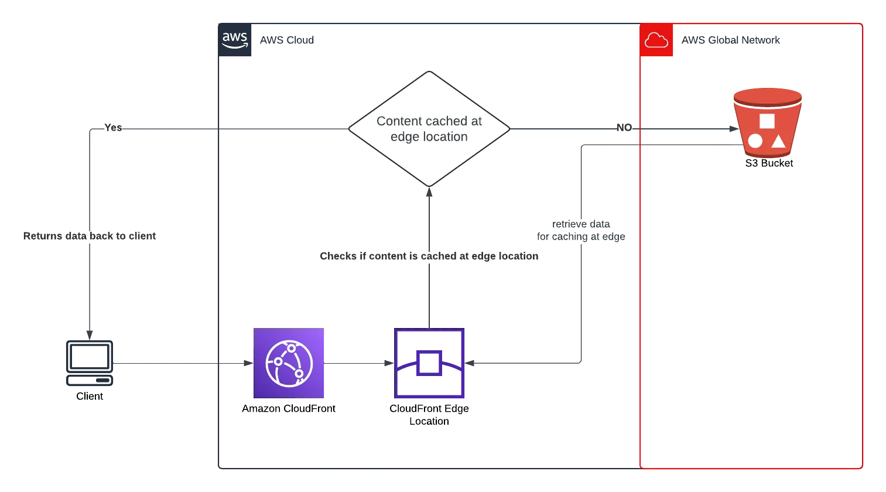

# S3-CloudFront-Image-Uploader

## 📌 Project Overview

This project allows users to upload images, which are then:

  * Stored in __Amazon S3__

  * Delivered securely and at scale via __Amazon CloudFront__

  * The S3 + CloudFront URLs are saved into a __MySQL__ database hosted on EC2

## 🚀 Features
  * Upload images via a web form hosted on EC2

  * Store images in Amazon S3 bucket

  * Access images through CloudFront CDN

  * Save image URLs (S3 + CloudFront) in MySQL

  * Easy deployment & scalable architecture

  ## 🏗️ Architecture
 


  ## ⚙️ Tech Stack

  * __Frontend:__ HTML, CSS

  * __Backend:__ PHP 

  * __Database:__ MySQL

  * __Cloud Services:__ AWS S3, CloudFront and EC2

  * __Web Server:__ Nginx

## Lauch EC2 Instance
  * Launch an EC2 instance 

  * Install required packages:
  ```
  # Update packages
sudo yum update -y

# Install Nginx
sudo yum install nginx -y

# Install PHP
sudo yum install php php-mysqlnd php-fpm -y

# Install MySQL server
sudo yum install mariadb105-server -y
  ```
  Start Services:
  ```
sudo systemctl start nginx
sudo systemctl enable nginx
sudo systemctl start mariadb
sudo systemctl enable mariadb
sudo systemctl start php-fpm
sudo systemctl enable php-fpm
  ```


  ## Configure Database

  __Create a MySQL table:__

  ```
  CREATE DATABASE facebook;
  USE facebook;

  CREATE TABLE users (
    id INT AUTO_INCREMENT PRIMARY KEY,
    image_name VARCHAR(255) NOT NULL,
    s3_url VARCHAR(500) NOT NULL,
    cloudfront_url VARCHAR(500) NOT NULL,
    uploaded_at TIMESTAMP DEFAULT CURRENT_TIMESTAMP
);

  ```
  <br>

  .png)

  ## Setup AWS S3

  Create an S3 bucket and enable public access / bucket policy

  In the Policy editor, copy and paste the following and replace YOUR_BUCKET_NAME with the name of your S3 bucket:
  ```
  {
  "Version": "2012-10-17",
  "Statement": [
    {
      "Sid": "AddPerm",
      "Effect": "Allow",
      "Principal": "*",
      "Action": ["s3:GetObject","s3:PutObject"],
      "Resource": "arn:aws:s3:::YOUR_BUCKET_NAME/*"
    }
  ]
}
  ```

  .png)

  ## Setup CloudFront
  Create a CloudFront distribution pointing to the S3 bucket

  .png)

 ## OUTPUT
 index.html:
 <br>

 .png)

<br>
index.php:

<br>

.png)

Database:

.png)

## 📚 Future Improvements

  * Enable HTTPS with Let’s Encrypt 

  * Add authentication for uploads

  * Use Amazon RDS instead of local MySQL


  

